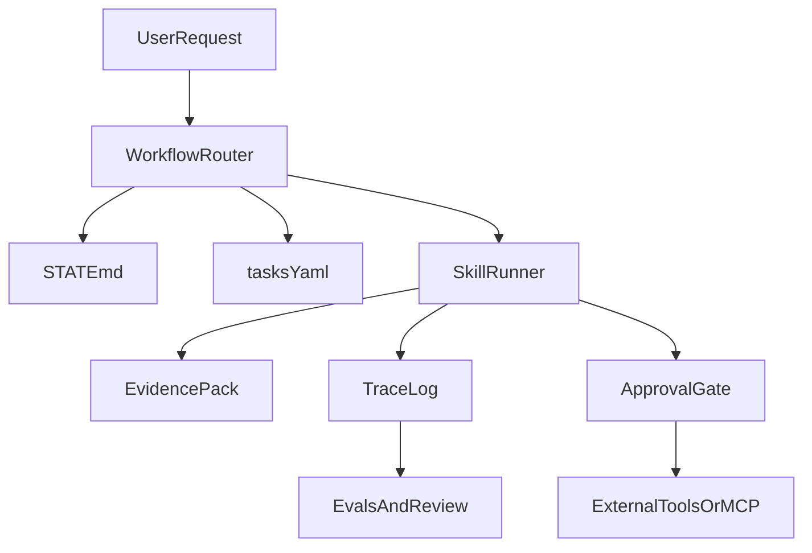

# AI-OS Agent Control Plane 设计

## 目标

把 AI-OS 从“rules + docs”升级为“rules + execution + validation + observability”的交付控制平面。

## 设计范围

- 标准化执行轨迹
- 高风险操作审批策略
- MCP 适配层
- 多 agent 协作模式

## 对外命令面

为了降低首次成功路径的复杂度，对外产品面应保持两层分工：

- workflow 负责把用户送进正确场景，按 `Start -> Continue -> Finish / Govern` 分层
- CLI 负责稳定、可脚本化的检查和状态恢复命令面

建议长期保持下面这组稳定心智：

- `Start`：`/new-project`、`/map-codebase -> /new-module`、`/quick`、`/clone-project`
- `Continue`：`/status`、`/next`、`/resume`、`/auto-advance`
- `Finish / Govern`：`/review`、`/ship`、`/change-request`、`/debug`、`/incident`、`/postmortem`
- `CLI`：`create-ai-os <command>` 统一承载 `doctor`、`validate`、`status`、`next`、`resume`、`diff`、`upgrade`、`release-check`

这意味着 AI-OS 的定位应当始终是“交付控制面”，而不是只做 spec authoring 的单点工具。

## 总体结构

## 1. 执行轨迹

每次 workflow 执行建议记录以下字段：

- `session_id`
- `workflow_id`
- `trigger_phrase`
- `state_snapshot`
- `activated_skills`
- `task_ids`
- `approval_events`
- `evidence_outputs`
- `final_decision`

建议优先保持与 OpenTelemetry 风格兼容，至少做到：

- 每次 workflow 是一个 trace
- 每个 skill 调用是一个 span
- 高风险审批是独立事件
- 证据包路径可被 trace 引用

## 2. 审批策略

默认分三级：

- `auto`：只读、低风险、本地分析
- `confirm`：删除、状态流转、外部费用调用、生产写操作
- `block`：未校验凭证、批量破坏性操作、越权访问

审批事件需要同时写入：

- `STATE.md` 的最近决策
- trace 中的 `approval_events`
- 如有交付影响，再同步 `release-plan.md`

## 3. MCP 适配层

目标不是替换 `AGENTS.md` / `SKILL.md`，而是增加一层标准化工具接入。

建议分三阶段：

1. `consume-mcp`
   - AI-OS workflow 可以调用受控 MCP tools
   - 与审批策略联动
2. `expose-mcp`
   - 把 AI-OS 的校验、状态、发布检查能力暴露为 MCP tools
3. `hosted-control-plane`
   - 把 workflow 路由、trace、approval 和 evals 聚合到远端控制面

## 4. 多 Agent 协作模式

推荐官方沉淀 4 种模式：

- `lead-subagent`
  - 主代理规划，子代理做上下文压缩或局部执行
- `review-loop`
  - 实现代理产出，审查代理回看 spec / acceptance / evals
- `handoff-summary`
  - 每次代理切换必须输出 handoff 摘要
- `human-takeover`
  - 命中高风险审批或 blocker 时切人

## 5. 先落地什么

- 先把 `doctor/validate/status/next/resume/diff/upgrade/release-check` 这些 CLI 变成可被 MCP 暴露的稳定命令面
- 再为 workflow 执行补 trace schema
- 最后引入 hosted MCP 与远端观测聚合
